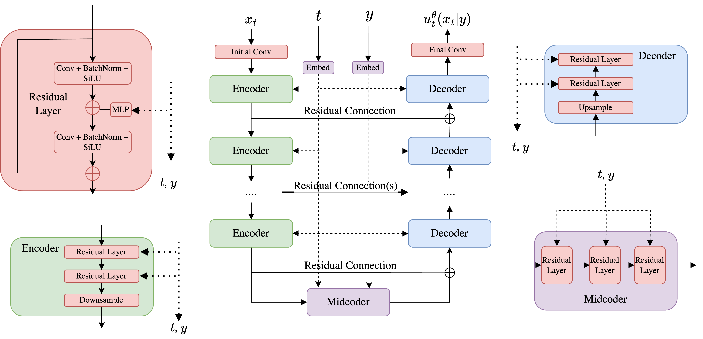

<div align = "center">

# Flow Matching for Synthetic Image Augmentation

Flow Matching Synthetic Image Generation for Data Augmentation

[**Overview**](#overview)
| [**Usage**](#usage)
| [**Results**](#results)
| [**Project Structure**](#project-structure)
| [**Method**](#method)
| [**Conclusion**](#conclusion)

</div>

## Overview

This project implements and validates synthetic data augmentation for computer vision using conditional flow matching (CFM) with classifier-free guidance (CFG), a state-of-the-art generative modeling technique. Our results indicate that incorporating synthetically generated samples into training improves classification accuracy and $\mathsf F_1$ score for coarse-grained fashion item classification compared with models trained solely on real data, with the largest gains observed in the extreme low-data regime (< 1% of the full dataset).

**Key Results**
- Modest but consistent accuracy gains (0.45% $-$ 0.8%) when flow model-based synthetic data augmentation is applied to 1% of the original training set
- Larger improvements (3.5% $-$ 4.9%) when augmenting 0.5% of the training data
- Most substantial gains (10.9% $-$ 19.4%) when augmenting only 0.1 $-$ 0.2% of the original training set
- 60,000 synthetic images generated across 10 fashion item categories
- Evaluation using ResNet-18 (pre-trained on ImageNet), fine-tuned on fractions of the training set, with and without synthetic augmentation

The implementation trains a conditional flow matching model on the training split of the [Fashion MNIST](https://github.com/zalandoresearch/fashion-mnist) dataset, using classifier-free guidance to generate class-conditioned synthetic samples. A ResNet-18 classifier, pre-trained on ImageNet, is then fine-tuned on varying fractions of the training data, with and without synthetic augmentation, to evaluate the impact of data augmentation. Classification performance is assessed using top-1 accuracy and the macro-averaged $\mathsf F_1$ score.

## Usage

1. Clone the repository.
```bash
git clone https://github.com/ZhangLyndon/FlowMatchingAugmentation .
```

2. Install dependencies.
```bash
pip install -r requirements.txt
```

3. Generate synthetic samples.
```bash
python flow/pipeline.py --num_samples 6000 \
						--generation_batch 6000 \
						--checkpoint_dir ./checkpoints
```

4. Fine-tune the pre-trained ResNet on the full training split of the Fashion MNIST dataset, using a held-out validation set to monitor cross-entropy loss and determine the optimal number of epochs to train for before overfitting.
```bash
python classification/train_classifier.py --data_root ./data \
										  --batch_size 16 \
										  --num_workers 0 \
										  --epochs 30 \
										  --lr 0.001 \
										  --weight_decay 1e-4 \
										  --step_size 15 \
										  --gamma 0.1 \
										  --classification_dir ./results/classification \
										  --checkpoint_dir ./checkpoints \
										  --save_interval 10
```

5. Evaluate the performance of the trained baseline classifier on the Fashion MNIST test set using top-1 accuracy and the macro $\mathsf F_1$ score. Subsequently, evaluate the effect of synthetic image augmentation on classification performance by fine-tuning on fractions of the training set with and without synthetic samples.
```bash
python classification/synthetic_augmentation.py --data_root ./data \
												--batch_size 16 \
												--num_workers 0 \
												--epochs 25 \
												--lr 0.001 \
												--weight_decay 1e-4 \
												--step_size 15 \
												--gamma 0.1 \
												--synthetic_data_dir ./images \
												--real_ratio 0.001 \
												--classification_dir ./results/classification \
												--augmentation_dir ./results/augmentation \
												--checkpoint_dir ./checkpoints \
												--save_interval 20
```

## Results

### Top-1 Accuracy

Top-1 accuracy represents the proportion of samples for which the model's highest-scoring predicted class $-$ i.e., the class with the largest logit or predicted probability $-$ matches the ground truth label. It is equivalent to standard classification accuracy, when evaluations are based on the highest-scoring class for each input.

| Data Fraction | Baseline<br>$(w = 3)$ | Augmented<br>$(w = 3)$ | Improvement<br>$(w = 3)$ | Baseline<br>$(w = 5)$ | Augmented<br>$(w = 5)$ | Improvement<br>$(w = 5)$ |
| :-----------: | :-------------------: | :--------------------: | :----------------------: | :-------------------: | :--------------------: | :----------------------: |
| 0.1%          | 59.07%                | 78.43%                 | 19.36%                   | 57.88%                | 74.51%                 | 16.63%                   |
| 0.2%          | 66.61%                | 79.56%                 | 12.95%                   | 64.65%                | 75.59%                 | 10.94%                   |
| 0.5%          | 76.48%                | 81.34%                 | 4.86%                    | 74.49%                | 77.97%                 | 3.48%                    |
| 1%            | 80.62%                | 81.08%                 | 0.46%                    | 80.48%                | 81.29%                 | 0.81%                    |
| 10%           | 88.56%                | 87.41%                 | -1.15%                   | 87.95%                | 87.13%                 | -0.82%                   |
| 100%          | 92.63%                | 91.67%                 | -0.96%                   | 92.13%                | 91.83%                 | -0.3%                    |

We observe the largest gains (> 10%) in the extreme low-data regime, specifically when augmenting 0.1% $-$ 0.2% of the original training set (6-12 samples per class). Increasing the data budget to 0.5% (30 samples per class) yields smaller, but still significant, improvements of 3.5% $-$ 4.9%. At 1% (60 samples per class), synthetic data augmentation provides modest but consistent gains (0.45% $-$ 0.8%), with negligible improvements beyond this point.

This result is particularly notable in light of [prior](https://github.com/Srecharan/GenVision) work, which reported a 4.1% improvement in classification accuracy when augmenting the full training split of the [Caltech-UCSD Birds 200-2011](https://www.vision.caltech.edu/datasets/cub_200_2011) (CUB-200-2011) dataset. CUB-200-2011 is a well-known _fine-grained_ visual classification benchmark comprising approximately 30 samples per class across 200 classes, whereas Fashion MNIST is comparatively coarse-grained. The comparable gains observed here (3.5% $-$ 4.9%) at an equivalent data scale suggest that dataset size, rather than task complexity, is the primary factor driving the effectiveness of synthetic data augmentation.

This trend is further exemplified in the extreme low data regime (0.1% $-$ 0.2%, or 6-12 samples per class), where accuracy gains of 10.9% $-$ 19.4% were observed. Consistently, applying synthetic augmentation to 25% of the training set for the CUB-200-2011 dataset (approximately 7.5 samples per class) resulted in a comparable 8.9% increase in classification accuracy. This implies that the additional task complexity associated with fine-grained classification does not lead to a larger boost in accuracy when augmenting a dataset at similar data scale, as might be naively expected.

Varying the guidance scale used to generate synthetic samples ($w = 3$ versus $w = 5$) has only a minor impact on downstream classification gains. When the guidance scale is higher, samples adhere more strictly to class labels at the expense of diversity. In the extreme low-data regime (< 1%), this reduced variance causes a slight decrease in accuracy improvement, as the greater diversity found at $w = 3$ aids generalization by covering a broader portion of the underlying data distribution.

In contrast, when 1% of the training set is used, the limited diversity of the synthetic samples becomes less of an issue. In this regime, the sharpening of the class-conditional structure at $w = 5$ provides a clearer signal for the classifier, resulting in a marginal increase in accuracy improvement.

### Macro-Averaged $\mathsf F_1$ Score

The macro $\mathsf F_1$ score is the unweighted mean of $\mathsf F_1$ scores across all classes. It is useful for identifying systematic underperformance on individual classes, as all classes are treated equally, regardless of size.

| Data Fraction | Baseline<br>$(w = 3)$ | Augmented<br>$(w = 3)$ | Improvement<br>$(w = 3)$ | Baseline<br>$(w = 5)$ | Augmented<br>$(w = 5)$ | Improvement<br>$(w = 5)$ |
| :-----------: | :-------------------: | :--------------------: | :----------------------: | :-------------------: | :--------------------: | :----------------------: |
| 0.1%          | 0.5731                | 0.7854                 | 0.2123                   | 0.5564                | 0.7432                 | 0.1868                   |
| 0.2%          | 0.6754                | 0.7938                 | 0.1184                   | 0.6536                | 0.7556                 | 0.102                    |
| 0.5%          | 0.7673                | 0.8128                 | 0.0455                   | 0.7474                | 0.7826                 | 0.0352                   |
| 1%            | 0.8023                | 0.8122                 | 0.0099                   | 0.8027                | 0.8138                 | 0.0111                   |
| 10%           | 0.885                 | 0.875                  | -0.01                    | 0.8791                | 0.8726                 | -0.0065                  |
| 100%          | 0.9264                | 0.9161                 | -0.0103                  | 0.9216                | 0.9179                 | -0.0037                  |

The macro $\mathsf F_1$ score follows a similar trend as top-1 accuracy, suggesting that dataset size, rather than task complexity, is the primary factor driving benefits from augmentation. In addition, it indicates no consistent underperformance across individual classes.

## Project Structure

```
FlowMatchingAugmentation
├── assets				# Project resources
├── checkpoints			# Model checkpoints (ResNet, U-Net)
├── classification		# ResNet training / synthetic augmentation pipeline
├── flow				# Conditional flow matching pipeline
├── images				# Synthetic image samples
├── notebooks			# Model training, validation, and evaluation
├── results				# Experiment results
├── utils				# Dataset loaders and evaluation metrics
```

## Method

The procedure for training the CFG conditional flow matching (CFM) model is detailed in the corresponding [notebook](./notebooks/01_flow_matching.ipynb). In brief, a U-Net is trained to approximate a time-dependent vector field that transports samples from an initial noise towards a target conditional data distribution. During training, pairs of images and labels are drawn from a labeled dataset, and a Gaussian conditional probability path is defined to smoothly interpolate between noise and data. To enable classifier-free guidance, an unguided vector field, corresponding to the absence of conditioning, is obtained by randomly dropping class labels with probability $\eta$. During inference, this unguided vector field serves as a baseline, and a guidance scale $w$ is applied to the difference between the guided and unguided fields to reinforce the effect of the class label.

The architecture of the U-Net is as follows:



1. The time step is encoded as learnable Fourier features to capture high-frequency temporal variations. Class labels are represented as embedding vectors for each of the $N + 1$ classes, including the null class. Both time and class embeddings are then converted into channel-specific modulations via an affine transformation, which are applied to every pixel in the image.

2. The core building block is the residual layer, which takes an input image and computes the cross-correlation between each input patch and its corresponding kernel weights, thereby extracting spatial features at every pixel. It forms the basis of the network's key components: encoders, which extract hierarchical features while downsampling and increasing channel depth; midcoders, which process the most abstract, high-level feature representations; and decoders, which reconstruct the image from learned feature maps by progressively upsampling and refining features.

3. Short range residual connections, applied after the convolutional blocks within each residual layer, help stabilize gradients, while long-range residual connections connect each encoder/decoder pair and help preserve fine spatial detail.

4. Images take the following path through the neural network:

	a) An initial convolution transforms 1-channel grayscale inputs into feature maps at the starting channel count.

	b) A sequence of 2 encoders progressively downsamples the feature map while doubling the channel count to extract increasingly abstract features. The output feature map is cloned to add back later as a residual connection.
	
	c) The midcoder processes features at the most abstract representation (here, 128 channels and $8\times 8$ pixels).
	
	d) Residual connections add encoder feature maps back to corresponding decoder stages in LIFO order to preserve fine-grained spatial detail. Each decoder then upsamples the feature map via bilinear interpolation, followed by a convolution that halves the channel count, to reconstruct the image output.
	
	e) A final convolution produces a 1-channel prediction for the conditional vector field from decoded features.

At inference time, the neural network approximation $u_t^\theta\left(x\negmedspace\mid\negmedspace y\right)$ of the guided vector field $u_t^\mathrm{target}\left(x\negmedspace\mid\negmedspace y\right)$ is linearly combined with that of the unguided vector field $u_t^\mathrm{target}\left(x\negmedspace\mid\negmedspace\varnothing\right)$ to produce the classifier-free guided vector field $\tilde u_t\left(x\negmedspace\mid\negmedspace y\right)$.

We next fine-tune a ResNet-18 classifier pretrained on ImageNet, replacing its final fully connected layer with a dropout-regularized linear classifier adapted to the 10-class task (the null class is excluded, as it is irrelevant for purposes of classification). The initial convolution layer is modified to process single-channel grayscale images, instead of the usual 3-channel RGB input.

To prevent overfitting, we partition the Fashion MNIST training set into an 80% training and 20% validation split. We monitor the cross-entropy loss on the validation set to determine the optimal number of epochs to train for before overfitting occurs. We find that epoch 21 (out of 30) achieves the lowest validation loss (0.2141), with nearby epochs (16 $-$ 25) clustering tightly between 0.2141 and 0.2267. To ensure consistency and fairness when evaluating the impact of synthetic data augmentation, subsequent training runs are standardized to 25 epochs.

To evaluate the impact of synthetic data augmentation on classification performance, we fine-tune the ResNet classifier on various fractions (0.1% / 0.2% / 0.5% / 1% / 10% / 100%) of the Fashion MNIST training set, both with and without synthetic image augmentation. The synthetic corpus consists of 60,000 images $-$ equivalent in size to the full Fashion MNIST training split $-$ distributed evenly across 10 fashion item categories.

We evaluate classification performance using top-1 accuracy and the macro-averaged $\mathsf F_1$ score. The $\mathsf F_1$ score for each class is calculated as $\displaystyle\mathsf F_1 = \frac{2}{\mathrm{precision}^{-1} + \mathrm{recall}^{-1}} = \frac{2\times\mathrm{TP}}{2\times\mathrm{TP} + \mathrm{FP} + \mathrm{FN}}$, and the macro-averaged $\mathsf F_1$ score then computed by averaging the per-class $\mathsf F_1$ across all categories.

## Conclusion

Synthetic data augmentation using images generated by conditional flow matching with classifier-free guidance substantially improves classifier performance on a coarse-grained visual classification benchmark, particularly in the extreme low-data regime (< 1% of the full dataset). Comparable gains at equivalent data scales to a fine-grained visual classification benchmark suggest that the primary driver of these improvements is dataset size, rather than task complexity.

Varying the guidance scale during synthetic sample generation leads to only modest differences in downstream classification performance, with higher sample diversity being more beneficial under extremely limited training set size, and stronger guidance, which sharpens the class-conditional structure, yielding larger gains when more real data are available.

Evaluation of classification performance by the macro $\mathsf F_1$ score yields trends similar to top-1 accuracy, indicating no systematic underperformance concentrated in specific classes.